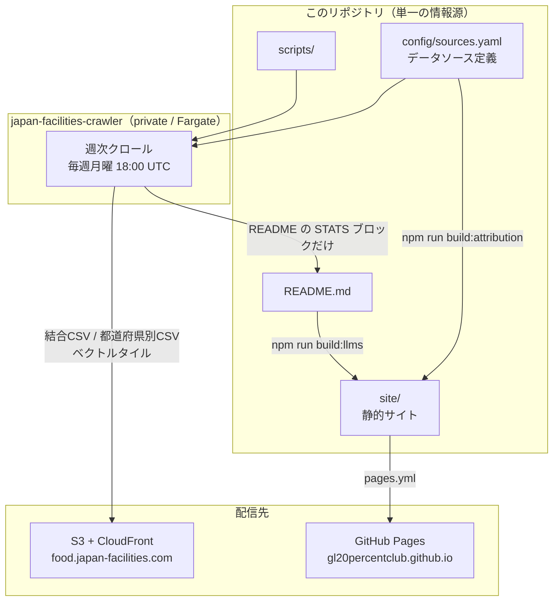

# アーキテクチャ

このリポジトリが何をどこで生成し、どこへ配信しているかをまとめています。
最初に読むと、どのファイルを触ればいいかの見当がつきます。

## 全体像



ポイントは2つです。

1. **クロールはこのリポジトリでは走らない。** 週次クロールと S3 への配信は、別リポジトリ
   [japan-facilities-crawler](https://github.com/gl20percentclub/japan-facilities-crawler)
   の Fargate タスクが担います。結合CSV は数百MB あり、GitHub の 100MB 制限で Git 配信
   できないためです。このリポジトリは `api/` を生成も管理もしません（`.gitignore` 対象）。
2. **データとページで配信先が違う。** データは S3 + CloudFront、静的ページは GitHub Pages です。

## ディレクトリ構成

```
japan-food-facilities/
├── README.md              # プロジェクトの入口（データの使い方）
├── CONTRIBUTING.md        # 貢献の手順
├── AGENTS.md              # AIコーディングエージェント向けのガイド
│
├── config/
│   └── sources.yaml       # データソース定義。自治体の追加はここだけ
│
├── site/                  # gh-pages に配信する静的サイト（中身がそのまま公開される）
│   ├── index.html
│   ├── map.html
│   ├── playground.html    # map.html へのリダイレクト
│   ├── attribution.html   # 自動生成
│   ├── llms.txt           # 自動生成
│   ├── llms-full.txt      # 自動生成
│   └── _headers
│
├── docs/
│   ├── ARCHITECTURE.md    # このファイル
│   ├── DATA.md            # 収録範囲・精度・更新頻度
│   └── COVERAGE.md        # 自治体ごとの収録状況（自動生成）
│
├── scripts/
│   ├── crawl.js           # エントリポイント: 取得 → 正規化 → 配信物の生成
│   ├── validate-api.js    # エントリポイント: 生成済み api/ の検証
│   ├── lib/               # 取得・パース・正規化・ジオコーディング・名寄せ
│   ├── build/             # 配信物の生成（結合CSV・都道府県別CSV・ベクトルタイル）
│   ├── generate/          # ドキュメントの生成（attribution.html・llms*.txt・README統計）
│   └── tools/             # 単発・保守用（本番パイプラインからは呼ばれない）
│
└── api/                   # 生成物。.gitignore 対象で Git 管理しない
```

テストは実装と同じディレクトリに `*.test.js` として置いています。

## クロールの流れ

`scripts/crawl.js` が全体のオーケストレーターで、各段の実装は `scripts/lib/` にあります。

| 段 | 実装 | やること |
| --- | --- | --- |
| 取得 | `lib/acquire.js` | `sources.yaml` の `acquire` に従って CSV・Excel を取ってくる（CKAN / 直接GET / POST / 掲載ページからのURL解決） |
| パース | `lib/parse.js` | 文字コードを判定して表形式に変換する |
| 正規化 | `lib/normalize.js` | 自治体ごとにバラバラな列名を内部キーに寄せ、共通の項目へ変換する |
| 名寄せ | `lib/city-normmap.js` | 市区町村の表記ゆれを正規化する |
| ジオコーディング | `lib/geocode.js` | 座標を持たないレコードを住所から補完する |
| 座標の品質フィルタ | `lib/coord-quality.js` | 施設の位置として信用できない座標を落とす（レコードは残す） |
| 行政界の突き合わせ | `lib/pref-boundary.js` | 都道府県の外に落ちている座標を落とす |
| 座標の統一 | `lib/name-cluster.js` | 同一施設とみなせる近接レコードの座標を1点に寄せる |
| 出力 | `build/*.js` | 結合CSV・都道府県別CSV・ベクトルタイルを `api/` に書き出す |

生成物が正しいかは `scripts/validate-api.js`（`npm run test:api`）が検証します。
これはユニットテストではなく、クロール後の `api/` が無いと動きません。

## 生成物と生成元

**生成物は直接編集しないでください。** 生成元を変えて再生成します。

| 生成物 | 生成元 | 再生成 | 誰が更新するか |
| --- | --- | --- | --- |
| `site/attribution.html` | `config/sources.yaml` | `npm run build:attribution` | このリポジトリ |
| `site/llms.txt` / `site/llms-full.txt` | `README.md` | `npm run build:llms` | このリポジトリ |
| `README.md` の STATS ブロック | クロール結果 | — | 週次クローラー |
| `docs/COVERAGE.md` | クロール結果 | — | 週次クローラー |
| `api/` 一式 | クロール結果 | — | 週次クローラー |

### 所有権の境界

`config/sources.yaml` と、そこから作られる `attribution.html` / `llms*.txt` は
**このリポジトリが唯一の情報源**です。クローラー側がこれらを生成・push してはいけません。
外部から渡してよいのは README の STATS ブロックだけです。

過去に、クローラーが自分の持っていた古い `sources.yaml` のスナップショットから
`attribution.html` を生成して main に push し、旧リポジトリ名とライセンス未確定で除外した
ソースが公開ページへ巻き戻る事故がありました。

## ワークフロー

| ファイル | 発火 | 役割 |
| --- | --- | --- |
| `ci.yml` | PR / main への push | `npm run test:unit` を実行。生成物の同期テストを含むので、生成元だけ直して再生成し忘れた PR はここで落ちる |
| `pages.yml` | main への push（`site/**` 等） | `site/` を gh-pages へ配信。配信前に必ず生成元から作り直すので、公開ページは常に main と一致する |
| `generated-docs.yml` | main への push | main 上の生成物が生成元とずれていたら再生成してコミットする（自己修復） |

配信ワークフローの設定は `scripts/workflows.test.js` が固定しています。
`pages.yml` / `generated-docs.yml` / `ci.yml` を変更したら、このテストも必ず確認してください。

### 配信の注意点

- `pages.yml` の配信元は `site/` だけです。`site/` の中身が gh-pages のルートに置かれるため、
  公開 URL は `/index.html`・`/map.html`・`/llms.txt` になります。ページを増やすときは
  `site/` に置けば `paths: site/**` で自動的に拾われます。
- `keep_files: true` のため**ファイル削除は反映されません**。ページを削除・リネームしたときは
  gh-pages 上の旧ファイルを手動で消してください。

## やりたいこと別・触るファイル

| やりたいこと | 触るファイル |
| --- | --- |
| 自治体を追加する | `config/sources.yaml` |
| 元データの列名の揺れに対応する | `config/sources.yaml` の `columns:` |
| 正規化のロジックを直す | `scripts/lib/normalize.js` |
| 配信するCSVの列を変える | `scripts/build/merged-csv.js` |
| ベクトルタイルの中身を変える | `scripts/build/tiles.js` |
| LP・地図の見た目を変える | `site/index.html` / `site/map.html` |
| 出典表示ページの内容を変える | `scripts/generate/attribution.js`（`attribution.html` は生成物） |
| AI向けドキュメントを変える | `README.md`（`llms*.txt` は生成物） |
