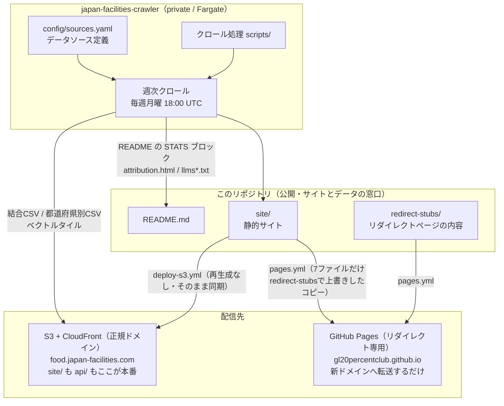

# アーキテクチャ

このリポジトリが何をどこで生成し、どこへ配信しているかをまとめています。
最初に読むと、どのファイルを触ればいいかの見当がつきます。

## 全体像



ポイントは3つです。

1. **クロール処理はこのリポジトリには無い。** 取得ノウハウ（自治体・省庁ごとの正規表現や
   正規化ロジック）が競争優位性のため、private リポジトリ
   [japan-facilities-crawler](https://github.com/gl20percentclub/japan-facilities-crawler)
   へ移行した（ADR は private リポジトリの `docs/adr/0001-crawl-script-ownership.md` を参照）。
   結合CSV は数百MB あり GitHub の 100MB 制限で Git 配信できない点も変わらず、このリポジトリは
   `api/` を生成も管理もしない（`.gitignore` 対象）
2. **このリポジトリが持つのは公開サイト（`site/`）とデータの窓口（README・ドキュメント）だけ。**
   `site/attribution.html` / `site/llms.txt` / `site/llms-full.txt` は private リポジトリの
   Fargate タスクが生成してこのリポジトリへ push する**成果物**で、直接編集しない
3. **正規の配信先は S3 + CloudFront（`food.japan-facilities.com`）1つだけ。** データ
   （`api/`）だけでなく静的ページ（`site/`）もここが本番。GitHub Pages
   （`gl20percentclub.github.io`）は本番ではなく、新ドメインへの**リダイレクト専用サイト**
   として残している（旧ドメインを知っている人・検索エンジンを新ドメインへ誘導するため）。
   `site/index.html` や `site/map.html` を編集しても GitHub Pages 側には反映されない
   （常に `redirect-stubs/` の内容で上書きされるため）。詳しくは後述の「ワークフロー」を参照

## ディレクトリ構成

```
japan-food-facilities/
├── README.md              # プロジェクトの入口（データの使い方）
├── CONTRIBUTING.md        # 貢献の手順
├── AGENTS.md              # AIコーディングエージェント向けのガイド
│
├── site/                  # 公開サイト。deploy-s3.yml がそのまま food.japan-facilities.com へ配信する
│   ├── index.html
│   ├── map.html
│   ├── playground.html    # map.html へのリダイレクト
│   ├── attribution.html   # private リポジトリが生成して push する成果物
│   ├── llms.txt           # 同上
│   ├── llms-full.txt      # 同上
│   └── _headers
│
├── redirect-stubs/        # GitHub Pages（旧ドメイン）用のリダイレクトページ。site/ とは別内容
│                          # （pages.yml がデプロイ直前に site/ のコピーへ上書きする）
│
├── docs/
│   ├── ARCHITECTURE.md    # このファイル
│   ├── DATA.md            # 収録範囲・精度・更新頻度
│   └── COVERAGE.md        # 自治体ごとの収録状況（private リポジトリが生成して push する）
│
├── scripts/
│   ├── map-filter.test.js     # map.html の業種フィルターの整合性テスト
│   └── workflows.test.js      # 配信ワークフローの設定テスト
│
└── api/                   # 配信物。このリポジトリには存在しない（S3 + CloudFront から配信）
```

テストは実装と同じディレクトリに `*.test.js` として置いています。

**クロール（取得・正規化・配信物生成）の実装は private リポジトリ
[japan-facilities-crawler](https://github.com/gl20percentclub/japan-facilities-crawler) にあります。**
`config/sources.yaml`（データソース定義）、`scripts/lib/`（取得・正規化・ジオコーディング）、
`scripts/build/`（結合CSV・都道府県別CSV・ベクトルタイル生成）、`scripts/generate/`
（`attribution.html`・`llms*.txt`・README統計の生成）は、いずれもこのリポジトリではなく
private リポジトリ側にあります。

**注意:** かつては `scripts/build/tiles.js` と、それを使って `map.html` とタイル生成物の
整合性を検証する `scripts/preview-map.test.js` をこのリポジトリにも置いていたが、
private リポジトリ側にも同じ `tiles.js` があり同一ファイルの二重管理になるため撤去した
（ADR の中心原則「コピーを持たない」に反するため）。**この撤去により、`map.html` の
レイヤ名・ズーム範囲・属性がタイル生成物とズレていないかを検証する仕組みが公開リポ側から
無くなっている。** 代替手段は未決（該当PRの本文を参照）。

## 生成物と生成元

**生成物は直接編集しないでください。** private リポジトリ側の生成元を変えて再生成します。

| 生成物 | 生成元 | 誰が生成・pushするか |
| --- | --- | --- |
| `site/attribution.html` | private リポジトリの `config/sources.yaml` | 週次クローラー（Fargate） |
| `site/llms.txt` / `site/llms-full.txt` | private リポジトリの生成スクリプト・このリポジトリの `README.md` | 週次クローラー（Fargate） |
| `README.md` の STATS ブロック | クロール結果 | 週次クローラー（Fargate） |
| `docs/COVERAGE.md` | クロール結果 | 週次クローラー（Fargate） |
| `api/` 一式 | クロール結果 | 週次クローラー（Fargate、S3 + CloudFrontへ） |

### 所有権の境界

`config/sources.yaml` と生成スクリプト一式は **private リポジトリが唯一の情報源**です。
このリポジトリは生成元のコピーを持たず、`site/attribution.html` / `llms*.txt` を
週次クローラーが push した**成果物として受け取るだけ**です。このリポジトリ側で
再生成・上書きしないでください（生成元が無いため再生成コマンド自体が存在しません）。

過去に、クローラーが自分の持っていた古い `sources.yaml` のスナップショットから
`attribution.html` を生成して main に push し、旧リポジトリ名とライセンス未確定で除外した
ソースが公開ページへ巻き戻る事故がありました。生成元を private リポジトリ側の1箇所に
一本化したのは、この種の巻き戻りを構造的に起こせなくするためです。

## ワークフロー

| ファイル | 発火 | 役割 |
| --- | --- | --- |
| `ci.yml` | PR / main への push | `npm run test:unit`（site/ の整合性テスト・配信ワークフロー設定テスト）を実行 |
| `deploy-s3.yml` | main への push（`site/**` 等） | **正規の配信。** `site/` をそのまま（再生成なし）`aws s3 sync` で S3 + CloudFront（`food.japan-facilities.com`）へ同期する |
| `pages.yml` | main への push（`site/**` / `redirect-stubs/**`） | GitHub Pages（旧ドメイン）へのリダイレクト配信。`site/` のコピーを作り、`index.html` 等7ファイルだけ `redirect-stubs/` の内容で上書きしてから gh-pages へ配信する（`site/` 自体は書き換えない） |

かつては `pages.yml` が配信前に `attribution.html` / `llms*.txt` を再生成し、
生成物のドリフトを自己修復する `generated-docs.yml` も存在したが、生成元が private
リポジトリへ移行したことでこのリポジトリ側では再生成できなくなったため、いずれも撤去した。

配信ワークフローの設定は `scripts/workflows.test.js` が固定しています。
`deploy-s3.yml` / `pages.yml` / `ci.yml` を変更したら、このテストも必ず確認してください。

### 配信の注意点

- **本番・正規ドメインは `https://food.japan-facilities.com/`（S3 + CloudFront、
  `deploy-s3.yml`）です。** `site/` を編集して push すると、公開 URL は
  `/index.html`・`/map.html`・`/llms.txt` のままこのドメインに反映されます。
  ページを増やすときは `site/` に置けば `paths: site/**` で自動的に拾われます。
- **GitHub Pages（`https://gl20percentclub.github.io/japan-food-facilities/`）は
  本番ではありません。** 新ドメインへの `<meta http-equiv="refresh">` リダイレクトだけを
  配信するサイトで、`pages.yml` が `index.html` / `map.html` / `playground.html` /
  `coord-quality.html` / `privacy.html` / `404.html` / `sitemap.xml` の7ファイルを
  `redirect-stubs/` の内容で常に上書きします。**この7ファイルは `site/` を編集しても
  GitHub Pages 側には反映されません。** `attribution.html` / `llms.txt` /
  `llms-full.txt` / `analytics.js` / `_headers` は上書き対象外で `site/` の内容が
  そのまま通ります（詳細は `redirect-stubs/README.md`）。
- `pages.yml` の `keep_files: true` のため**ファイル削除は反映されません**。
  ページを削除・リネームしたときは gh-pages 上の旧ファイルを手動で消してください。

## やりたいこと別・触るファイル

| やりたいこと | 触るファイル |
| --- | --- |
| 自治体を追加する | private リポジトリの `config/sources.yaml`（このリポジトリでは対応不可） |
| 正規化のロジックを直す | private リポジトリの `scripts/lib/normalize.js`（このリポジトリでは対応不可） |
| 配信するCSVの列を変える | private リポジトリの `scripts/build/merged-csv.js`（このリポジトリでは対応不可） |
| ベクトルタイルの中身を変える | private リポジトリの `scripts/build/tiles.js`（このリポジトリには無い） |
| LP・地図の見た目を変える | `site/index.html` / `site/map.html` |
| 出典表示ページの内容を変える | private リポジトリの生成スクリプト（`attribution.html` はこのリポジトリでは編集しない） |
| AI向けドキュメントを変える | README 本文は `README.md`（`llms*.txt` は private リポジトリが生成する成果物） |
| アクセス解析の測定IDを差し替える | `site/analytics.js`（手順は [ANALYTICS.md](ANALYTICS.md)） |
| 外部送信の公表内容を変える | `site/privacy.html`（送信内容を変えたら必ず追従する） |
| ページを追加する | `site/` に置く（`site/sitemap.xml` への追記も必要） |
